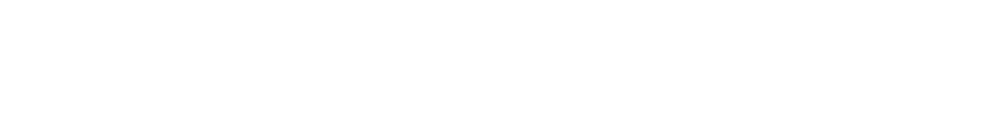

# 且慢品牌 Logo 资产

## 概述

按背景明暗分目录存放的且慢/盈米基金品牌 Logo 切图（PNG 格式），确保在不同背景下正确使用。

## 资产目录

| 目录 | 适用背景 | 调用场景 |
|------|----------|----------|
| [浅色背景](assets/浅色背景/) | 白、浅灰、浅蓝 | 常规 H5、白底落地页、浅色头图 |
| [深色背景](assets/深色背景/) | 深灰、深蓝、黑 | 深色首屏、暗色弹窗、深色 Banner |

## 浅色背景 Logo

在白色/浅色背景上使用的蓝色版本 Logo：

| 文件名 | 说明 |
|--------|------|
| `且慢logo-regular.png` | 且慢 Logo 标准版 |
| `且慢logo-Graphic.png` | 且慢 Logo 图形版 |
| `logo-slogan-regular.png` | 且慢 + 口号「安放财富·静待花开」 |
| `logo-组合.png` | 且慢 Logo 组合版 |
| `盈米logo-Regular.png` | 盈米基金独立 Logo |
| `盈米且慢logo-Regular.png` | 盈米基金 + 且慢组合 |
| `Group 193.png` / `Group 197.png` | 设计稿导出备用 |

## 深色背景 Logo

在深色/暗色背景上使用的白色版本 Logo：

| 文件名 | 说明 |
|--------|------|
| `且慢logo-white.png` | 且慢 Logo（白标 + 白字） |
| `且慢logo-Graphic-white.png` | 且慢 Logo 图形版（白） |
| `logo-slogan-white.png` | 且慢 + 口号「安放财富·静待花开」（白） |
| `盈米logo-white.png` | 盈米基金独立 Logo（白） |
| `盈米且慢logo-white.png` | 盈米基金 + 且慢组合（白） |
| `Group 427319881.png` / `Group 427319884.png` | 设计稿导出备用 |

## 使用指南

### HTML 引用

```html
<!-- 浅色背景 -->


<!-- 深色背景 -->



```

### CSS 变量

```css
:root {
  --logo-qieman-light: url('assets/浅色背景/且慢logo-regular.png');
  --logo-qieman-dark: url('assets/深色背景/且慢logo-white.png');
  --logo-yingmi-light: url('assets/浅色背景/盈米logo-Regular.png');
  --logo-yingmi-dark: url('assets/深色背景/盈米logo-white.png');
}
```

### 选择原则

- **页头海报**（`#3180EC` 背景）→ 使用深色背景版白色 Logo
- **白色卡片/页面**（`#FFFFFF` / `#F9FAFB`）→ 使用浅色背景版蓝色 Logo
- **页尾**（`#3180EC` 背景）→ 使用深色背景版白色 Logo

**规范出处**：且慢营销设计规范 → 3.4 Logo 与品牌标识
